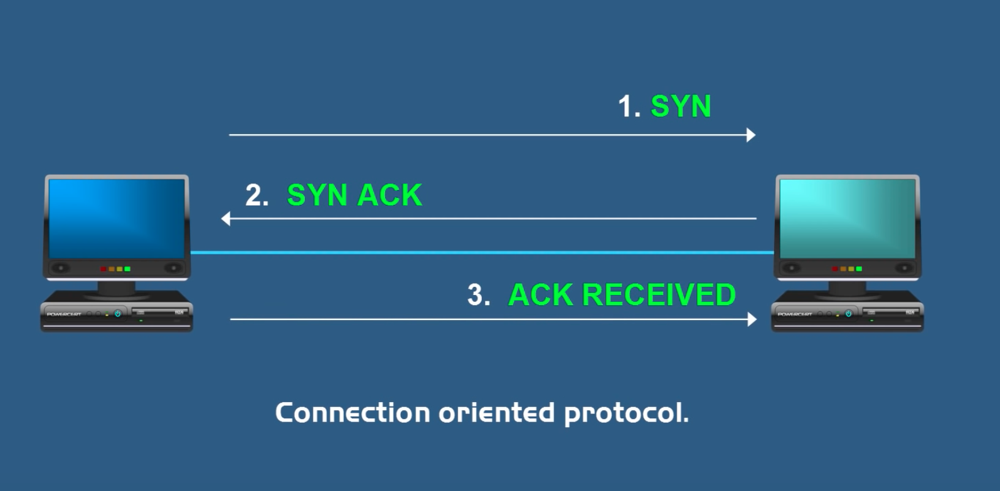
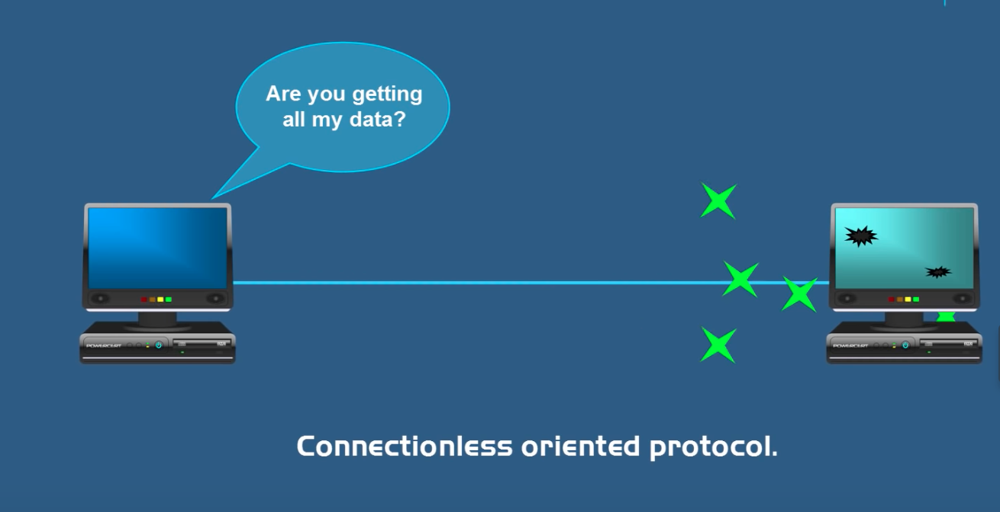
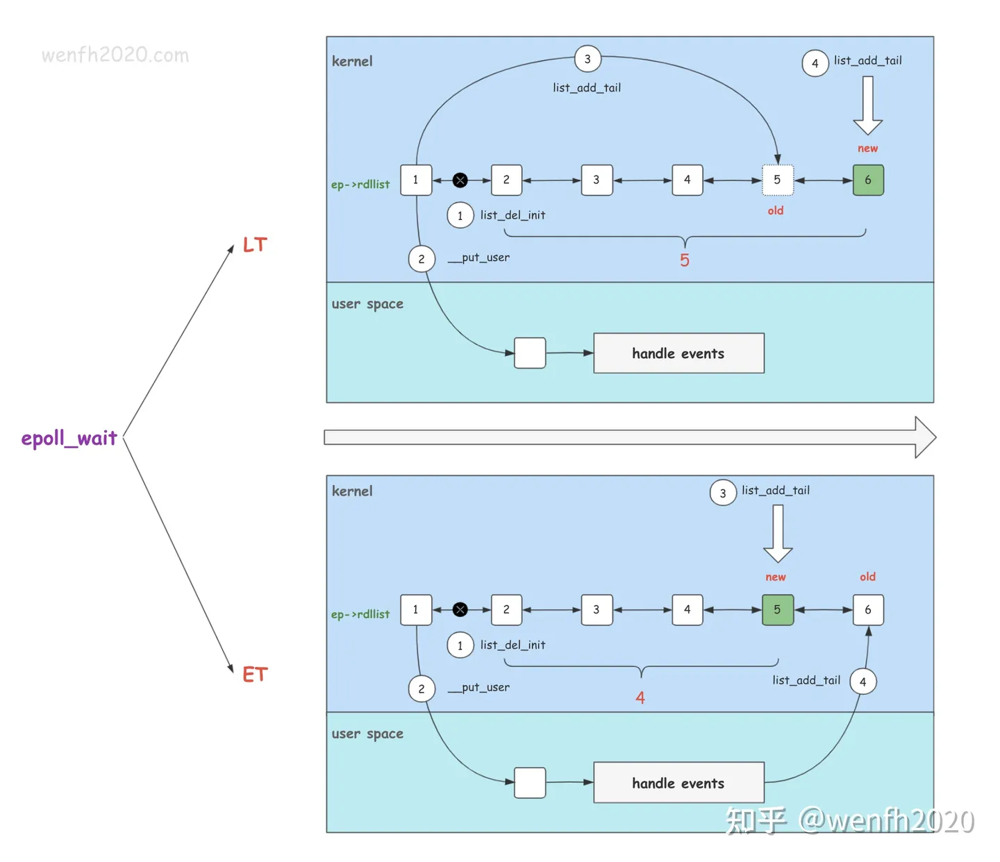

# TCP - transmission control protocl

Three hand shakes

TCP guarantees delivery of data

# UDP - user datagram protocol

connectionless oriented protocal, does not guarantees delivery of data

known as fire and forget protocol

UDP is faster than TCP

# epoll lt vs et

